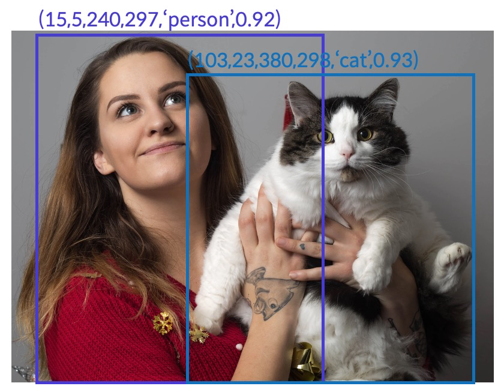

## Object Detection

Object Detection은 이미지 내에 존재하는 물체들의 위치와 물체의 종류를 검출하는 문제 영역입니다. 

Object Detection의 예측 결과로 이미지 내에서 **[Bounding Box의 꼭지점 좌표(x_min, y_min, x_max, y_max), label, 결과에 대한 확신의 정도]** 형태가 됩니다.

그림 1 - Object Detection 모델의 예측 결과 - (Bounding Box의 위치, label, 확신의 정도)

Object Detection 기술은 자율주행, 무인상점 운영 등 다양한 분야의 현실세계 문제에 활발히 사용 되고 있습니다.

그림 2 - Object Detection 기술을 활용한 Tesla 자동차의 자율주행

## Airbnb Amenity Detection

airbnb 데이터 사이언스 팀에서는 ML/DL 기술을 이용해서 자사 서비스 품질을 높이기 위한 다양한 시도를 진행하고 있습니다. 

그 중에서 호스트들이 Amenity 들을 하나하나 입력하지 않아도 업로드한 사진에 존재하는 **Amenity(편의용품)들을 Object Detection 기술을 이용해 검출**하여 고객에게 제공하는 기능을 개발 하였습니다.

본 프로젝트에서는 airbnb에서 블로그에 업로드한 진행과정을 토대로 구현하였습니다. [1]
## TensorFlow Object Detection API

TensorFlow Object Detection API는 구글에서 공개한 TensorFlow를 이용한 최신 딥러닝 모델을 이용한  Object Detection을 수행할 수 있는 API입니다.

Faster-RCNN, SSD, EfficientDet, CenterNet 등 Object Detection을 위한 최신 딥러닝 모델의 Pre-Trained 파라미터와 학습을 위한 코드와 설정파일 등을 제공합니다.

그림 5 - TensorFlow Object Detection API를 이용한 검출 예시

airbnb 데이터 사이언스 팀에서는 Faster R-CNN과 SSD 모델을 이용한 Object Detection을 검토하였습니다. 하지만 본 프로젝트는 이후에 제안된 **CenterNet[2] 모델을 이용하여 학습 및 평가**를 진행 하였습니다.

## Google Open Images Dataset

Google Open Image Dataset은 구글에서 공개한 대량의 이미지와 600개의 레이블에 대한 Bounding box를 포함하고 있는 데이터셋입니다. Open Image Dataset V4 기준으로 1,743,042장의 Training Image와 14,610,229개의 Bounding Box를 가지고 있습니다. [3]

그림 6 - Google Open Images Dataset V4에 대한 정보

airbnb 데이터 사이언스 팀과 동일하게 Google Open Images Dataset V4에서 30개의 Amenity label만을 추출하였습니다. 검출 타겟이 되는 30개의 amenity class는 아래와 같습니다.

> ['Toilet', 'Swimming pool', 'Bed', 'Billiard table', 'Sink',
'Fountain', 'Oven', 'Ceiling fan', 'Television', 'Microwave oven',
'Gas stove', 'Refrigerator', 'Kitchen & dining room table', 'Washing machine', 'Bathtub',
'Stairs', 'Fireplace', 'Pillow', 'Mirror', 'Shower',
'Couch', 'Countertop', 'Coffeemaker', 'Dishwasher', 'Sofa bed',
'Tree house', 'Towel', 'Porch', 'Wine rack', 'Jacuzzi']

전체 1,743,042장의 이미지에서 위 30개의 amenity class를 포함한 이미지를 선별한 결과 **총 34,835장의 이미지**를 학습을 위한 이미지로 선별하였습니다. 이중에서 **90%를 트레이닝 데이터로, 10%를 Evaluation을 위한 테스트 데이터**로 활용하였습니다.

# Training

CenterNet 모델을 이용해서 30개의 Amenity class를 포함하고 있는 34,835장의 이미지의 90%인 31,351장의 이미지를 이용해서 140,000 step의 트레이닝을 진행하였습니다.

그림 7 - 140,000 step 동안의 트레이닝 과정에 대한 TensorBoard 스크린샷

# Evaluation

140,000 step의 트레이닝 이후 34,835장의 이미지의 10%인 3,483장의 테스트 이미지에 대해 다음과 같은 Evaluation 결과를 얻을 수 있었습니다. 

그림 8 - Evaluation 과정에 대한 TensorBoard 스크린샷

전체 테스트 이미지에 대해서는 IoU 0.5이상을 정답으로 간주했을때 약 **14.32의 mAP 값**을 얻을 수 있었습니다.

개별 class 별로 IoU 0.5 이상을 정답으로 간주했을 때 Swimming pool 레이블 같은 경우 61.28의 mAP 값, Bathtub 레이블 같은 경우 5.33의 mAP 값, Oven 레이블 같은 경우는 19.38의 mAP 값을 얻을 수 있었습니다.

# Result

레이블 별로 mAP 값의 편차가 심한 모습을 볼 수 있는데, 이는 각 레이블에 대응되는 Training 이미지 개수의 편차가 심한 것이 주요 원인으로 보입니다. 따라서 labelling된 이미지를 추가하여 학습에 활용한다면 mAP를 향상시킬 수 있을 것입니다.

# References

[1] [https://medium.com/airbnb-engineering/amenity-detection-and-beyond-new-frontiers-of-computer-vision-at-airbnb-144a4441b72e](https://medium.com/airbnb-engineering/amenity-detection-and-beyond-new-frontiers-of-computer-vision-at-airbnb-144a4441b72e)

[2] [https://arxiv.org/abs/1904.07850](https://arxiv.org/abs/1904.07850)

[3] [https://storage.googleapis.com/openimages/web/factsfigures_v4.html](https://storage.googleapis.com/openimages/web/factsfigures_v4.html)