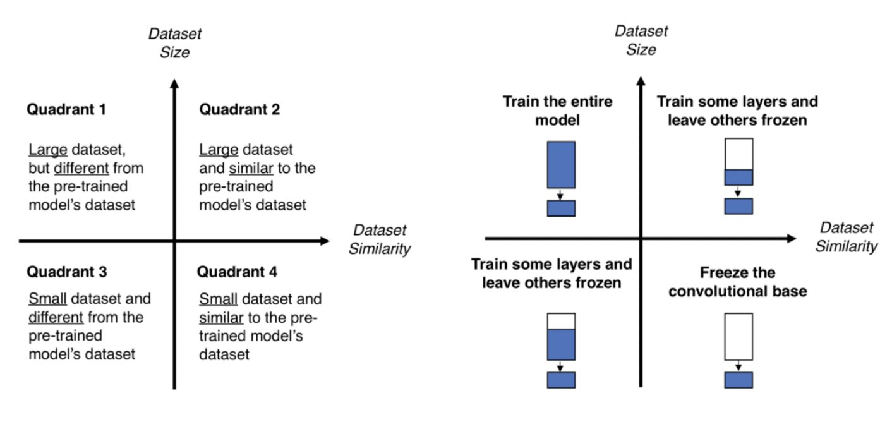
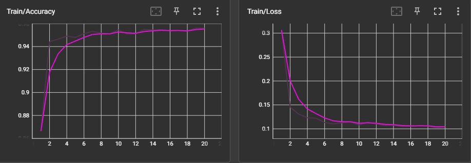
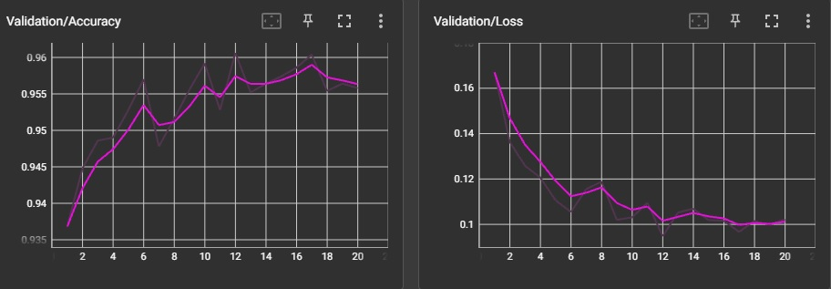
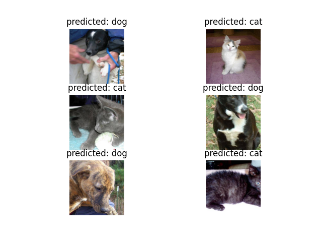
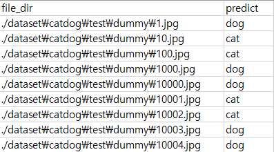

# 파이토치로 전이학습 분류 모델 만들기

## 개요

전이학습 과정을 파이토치 라이브러리를 활용하여 직접 구현한 프로젝트입니다.  
Backbone으로는 ImageNet으로 사전 학습된 resnet34 모델을 사용하였습니다.  
ImageNet은 2010년~2017년까지 매해 열린 대회 ImageNet Large-Scale Visual Recognition (ILSVRC)을 위한 데이터셋으로 자동차나 고양이를 포함한 1000개의 클래스, 총 1400만개의 이미지로 구성되어 있습니다.

## Requirements

Python==3.7.13  
torch==1.12.1+cu113  
torchvision==0.13.1+cu113  
tensorboard==2.10.0  

## 전이학습 방식 소개

**1) Fix loaded weights and train unloaded parts**  
FC layer를 제외하고 네트워크의 모든 매개 변수 가중치를 고정(freeze)합니다. 마지막 계층은 임의의 가중치로 초기화된 새로운 계층으로 대체되며, 오직 이 계층만 학습됩니다. 아래 그림에서 4번에 해당됩니다. 본 프로젝트에서 사용한 방법입니다.  

**2) train with different learning rate on each part**  
두 번째 방법은 랜덤 초기화 대신 미리 학습된 네트워크를 이용하여 모델을 초기화합니다. 이후 평소처럼 학습을 진행하지만 learning rate를 더 작게 하여 학습합니다. 네트워크가 이미 학습되었기 때문에 새로운 데이터셋으로 미세조정(finetuning)하는 개념입니다. 아래 그림에서 2 또는 3번에 해당됩니다.  



그림 1 - 전이학습 방식

## 코드 및 실행

코드 링크 : [https://github.com/sunheum/transfer_learning_classification](https://github.com/sunheum/transfer_learning_classification)

Train 실행 예시  
```bash
python train.py --model_fn resnet.pth --gpu_id 0 --n_epochs 20 --model_name resnet --n_classes 2 --freeze --use_pretrained
```

Predict 실행 예시
```bash
python predict.py --model_fn resnet.pth --gpu_id 0
```

## 결과

**Train / Validation**  

tensorboard 라이브러리를 활용하여 Accuracy, Loss값을 나타낸 결과입니다. train/valid 데이터셋 모두에서 95%이상의 정확도를 보여 주었습니다.  



그림 2 - Train Accuracy & Loss  



그림 3 - Validation Accuracy & Loss  

**Predict**  
예측 데이터셋에 대한 결과는 아래 이미지와 같습니다.  
일부 결과는 시각화하였고, 전체 예측 값은 predict.py 실행 시 result.csv로 저장됩니다.  



그림 4 - 예측 결과 시각화



그림 5 - result.csv 예시