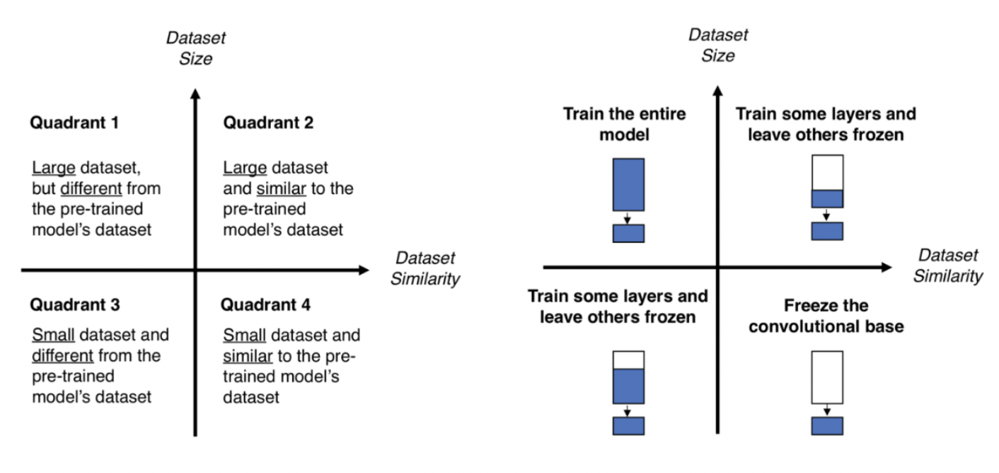
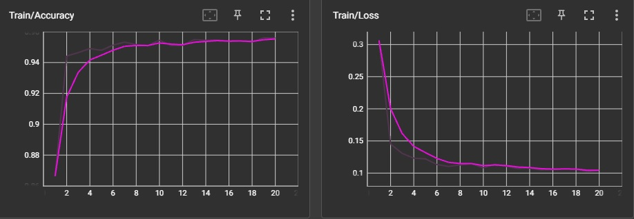
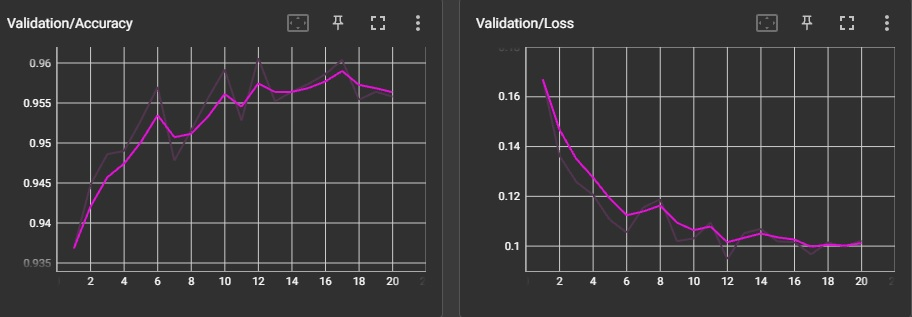
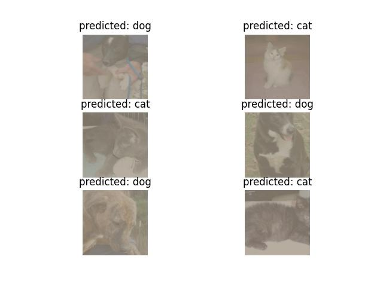

# 파이토치로 전이학습 분류 모델 만들기

## 개요

전이학습 과정을 파이토치 라이브러리를 활용하여 직접 구현한 프로젝트입니다.  
Backbone으로는 ImageNet으로 사전 학습된 resnet34 모델을 사용하였습니다.  
ImageNet은 2010년~2017년까지 매해 열린 대회 ImageNet Large-Scale Visual Recognition (ILSVRC)을 위한 데이터셋으로 자동차나 고양이를 포함한 1000개의 클래스, 총 1400만개의 이미지로 구성되어 있습니다.

## Requirements

Python==3.7.13  
torch==1.12.1+cu113  
torchvision==0.13.1+cu113  
tensorboard==2.10.0  

## 전이학습 방식 소개

**1) Fix loaded weights and train unloaded parts**  
FC layer를 제외하고 네트워크의 모든 매개 변수 가중치를 고정(freeze)합니다. 마지막 계층은 임의의 가중치로 초기화된 새로운 계층으로 대체되며, 오직 이 계층만 학습됩니다. 아래 그림에서 4번에 해당됩니다. 본 프로젝트에서 사용한 방법입니다.  

**2) train with different learning rate on each part**  
두 번째 방법은 랜덤 초기화 대신 미리 학습된 네트워크를 이용하여 모델을 초기화합니다. 이후 평소처럼 학습을 진행하지만 learning rate를 더 작게 하여 학습합니다. 네트워크가 이미 학습되었기 때문에 새로운 데이터셋으로 미세조정(finetuning)하는 개념입니다. 아래 그림에서 2 또는 3번에 해당됩니다.  



그림 1 - 전이학습 방식

## 코드 및 실행

코드 링크 : [https://github.com/sunheum/transfer_learning_classification](https://github.com/sunheum/transfer_learning_classification)

- set_dataset.py : dataset 경로를 만들고 학습에 사용할 catdog 데이터셋을 다운로드 합니다.  
- train.py : 학습시 실행하는 코드입니다. 크게 Train과 Valid로 구현되어 있습니다. 각 epoch마다 텐서보드에 지표(Accuracy, Loss)를 기록하고 가장 낮은 Loss값을 기록한 weight를 .pth파일로 저장합니다.  
- test.py : 테스트 데이터셋으로 예측을 실행합니다. 학습시 저장된 weight를 불러오고 테스트셋 dataloader를 불러와 예측을 수행하고 시각화합니다.  
- classification/data_loader.py : 다운받은 이미지 파일을 dataloader로 불러옵니다. data transformation, random split 등이 구현되어 있습니다.  
- classification/model_loader.py : 파이토치에서 제공하는 모델을 불러옵니다. pretrained 모델을 불러오고 파라미터를 freeze하는 설정이 되어있습니다.  
- classification/utils.py : 각종 유틸 함수  
- runs/transfer_learning_experiment : 텐서보드 로그가 저장되는 폴더입니다.

실행 예시  
```bash
python train.py --model_fn resnet.pth --gpu_id 0 --n_epochs 20 --model_name resnet --n_classes 2 --freeze --use_pretrained
```


## 결과

tensorboard 라이브러리를 활용하여 Accuracy, Loss값을 나타낸 결과입니다. train/valid 데이터셋 모두에서 95%이상의 정확도를 보여 주었습니다.  



그림 2 - Train Accuracy & Loss



그림 3 - Validation Accuracy & Loss  

테스트셋에 대한 결과는 아래 이미지와 같습니다.  
테스트셋은 라벨링이 되어있지 않아 지표를 뽑아보긴 어렵지만, 어느정도 잘 맞춤을 확인할 수 있습니다.



그림 4 - 테스트셋 결과